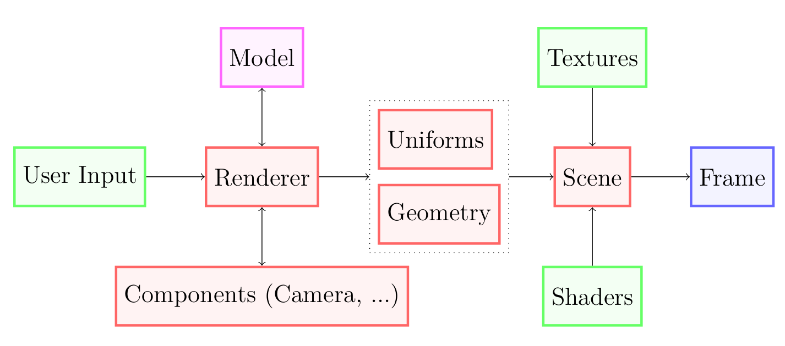
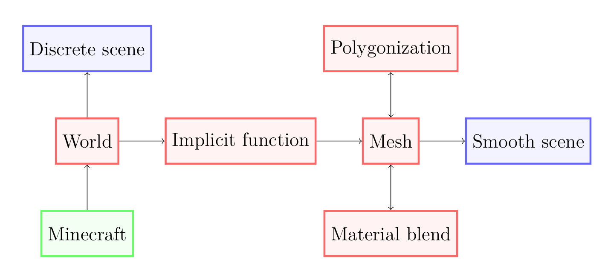

# Developer documentation
This document serves as a starting point for developers wanting to understand how this project works.

## System requirements
The application is written in [Rust](https://www.rust-lang.org/). 
Building the project requires a Rust 2021 compatible compiler as well as [cargo](https://doc.rust-lang.org/cargo/), rust's package manager.

The official Rust setup guide can be found [here](https://www.rust-lang.org/learn/get-started).

We always use the latest version of OpenGL available on the host hardware.
Our shaders use glsl `#version 400` so at least opengl 4.0 is required.

### OS Support
| Platform        | Support |
|-----------------|---------|
| Windows         | ✔️       |
| Linux (Xorg)    | ✔️       |
| Linux (Wayland) | ✔️       |
| MacOS           | ❌      |

## Development setup
Once you have rust setup, clone this repository if you didn't already.
Then all you need to build the project is to navigate to the root of the repository and run `cargo build`.
Cargo will take care of all the dependencies and build the project.
You can then use `cargo run` to run the application.
Learn more about using cargo in the [cargo book](https://doc.rust-lang.org/cargo/index.html)

## Project overview
We render graphics to the screen using OpenGL. We use the `glium` rust crate for interfacing with OpenGL.
It provides a type safe and higher abstraction way of calling OpenGL, which results in a less error prone and more comfortable development experience.
This allows us to do graphics in pure rust without using `unsafe` blocks.

The project is split into 2 parts:
- Renderer - handles 3D rendering, user input, camera, ...
- Minecraft smoother - handles loading a minecraft world and extracting its smooth representation

First we will explain some patterns common to the whole project, then we will go into detail for each part of the project.

### Typedefs
Across the project we use many type aliases for better readability and flexibility.
When working with floating point numbers, we use the type `Real` for general numbers and `Coord` when working with coordinates.
These are just type aliases of `f64`, but now we are explicit about their use and we could swap the internal representation with ease if we wanted to.

Another common type is `Position`. This represents a point in 3D space; each coordinate is a `Coord`.

## Renderer
We implement a batch renderer with support for instancing and real time user input.

The render loop looks something like this:
1. Translate user events into actions
2. Create a new render state for the frame
3. Update components based on the state
4. Render the scene

We will now explan each aspect of the renderer in greater detail.



### User input
User input events are translated into `Actions` based on a predefined mapping.
Input events that are not mapped are ignored.
The rest of the application then only has to handle our actions.

For details see `src/infrastructure/input.rs`

### Render state
We use a small render state struct to persist data between frames.
It is immutable and a new state is created each frame based on the previous state and user events.
It contains information like frame timings, whether the cursor is captured or that the renderer should shut down.

For details see `src/infrastructure/render_state.rs`

### Camera
We use a perspective 3D camera with a configurable aspect ratio and field of view. 
The camera orientation and position is updated every frame based on user actions.
The camera reponds to movement actions as well as mouse movement for looking around.
The orientation is calculated using transformation matrices. 

For details see `src/infrastructure/camera.rs`

### Rendering
Rendering using raw OpenGl calls can be cumbersome. With the help of glium we created a helper type that makes rendering relatively easy.
A `RenderFragment` represents a unit of rendering. 
It couples together geometry data as well as the shader that is used to render them.
It is created using `RenderFragmentBuilder` which utilizes the builder pattern to provision the fragment with everything it needs.

Example usage:
```rust
let fragment = RenderFragmentBuilder::new()
    .set_geometry(vertex_buffer, index_buffer)
    .set_vertex_shader(VERTEX_SHADER_SOURCE)
    .set_fragment_shader(FRAGMENT_SHADER_SOURCE)
    .build(display)
    .unwrap(); // <-- build returns a Result

fragment.render(target, uniforms, draw_parameters);
```

The builder assembles the shader into a program and the resulting fragment can then be rendered repeatedly, every time with different uniforms and draw parameters
if needed.
The builder currently returns a result, but since we are in rust, the state machine can be represented using types.
That way incorrect geometry/shader setup will not even compile! (This is yet to be implemented.)

We depend on glium to do all the heavy lifting of binding the buffers and managing the OpenGL calls. 
The buffers, uniforms and draw parameters in the snippet above all have types provided by glium.

The fragments are usually wrapped in a `RenderPass` struct, which adds the option to provide instance data.
The base geometry can then be efficiently rendered many times in a single render pass using instancing.

For details see
- `src/infrastructure/render_fragment.rs`
- `src/infrastructure/render_pass.rs`

and `src/main.rs` for usage examples.

### Textures
The `src/textures` module contains helper methods for loading textures from files.
We also implement a way of blending textures based on the neighboring materials of a point.
This is done in much the same way as sampling implicit function, but we accumulate each material separately.

### UI overlay
We also implement a simple ui overlay using `imgui`.
This can be used for general stats or debug info as well as controlling different parameters of the render.

See `src/infrastructure/imgui_wrapper.rs` for imgui integration and `src/main.rs` for usage examples.

## Model
In this section we will explain in detail how we handle rendering minecraft worlds as smooth surfaces.



### World data
We load world data directly from minecraft save files.
They are encoded using the `anvil` format and we depend on the `fastanvil` crate for parsing this data.
Only a small subset of block types are supported by our application. This number is not static and will increase as needed.

Minecraft worlds are infinite so we dont load them all at once, we load only a NxN grid of chunks at a time.
The size of the loaded world is configurable and directly affects performance.
The chunks are lazily loaded in a way that keeps the camera in the center of the NxN grid.
We only lazy load chunks in the XZ plane while always loading all the blocks in the Y direction.

See `src/model/discrete.rs` for the chunk centering algorithm.

### Sampling the implicit function
We implement the sampling as an intersection of a cubic convolution kernel with the world.
This process works like this:
1. find all chunks that intersect the kernel in the XZ plane
2. for every intersected chunk find all the blocks that intersect the Y range of the kernel
3. for every block that intersects the kernel, evaluate the exact volume of the intersection
4. sum up all the block intersections

Most of the code in `src/model/discrete.rs`, `src/model/chunk.rs` and `src/model/material_tower.rs`
revolves around making a query like this possible on the partitioned 3D voxel data.

### Creating the mesh
Creating a mesh of an implicit surface can be done in many ways.
We implemented a technique known as **Marching Cubes**, but it isn't hard to implement other methods.
To add another method of polygonization all that needs to be done is implement a function with the following signature
```rust
pub fn polygonize(
    support: Rectangle3D,
    density_func: impl Fn(Position) -> Real,
    material_func: impl Fn(Position) -> MaterialBlend,
) -> Mesh
```
where `support` is the volume for which we want the mesh, 
`density_func` is the implicit function and 
`material_func` is a function that will for each point in space return the material blend at that point.
There was no need for a trait for these polygonization methods, so there isn't one, but it will be added in the future if more methods are added.

For details see the `model/polygonization` module.

### Config
A number of constants can be tweaked to control the output of the application.
They have been hoisted into their own file `src/config.rs`.

See `setup.md` for details.

## Shading
We use the standard shading pipeline.

### Textures
To preserve the minecrafty feel, we use very low resolution pixel art textures.
Since there are many different types of blocks, each with its own texture we need many different textures.
Texture binding slots are limited in shaders, however, so we pack all of our textures into a single texture - a texture pallette.
When we need to sample one of the tiles of the pallette we manually transform the texture coordinates into the correct region of the pallette.

The textures are in the `sRGB` color space and must be created **without** mipmaps. Having mipmaps causes aliasing when sampling pixel art textures.
To avoid aliasing, another speciality is needed. Due to floating point error, we can get inconsistent pixel colors on the boundaries of the textures.
To solve this, we manually offset the texture coordinates so they always point to the center of the pixel we want to sample.
Without these 2 adjustments we experiences artefacts on texture boundaries.

### Lighting
We use a gamma corrected pipeline for lighting.
Our shaders return colors in `RGB` and are automatically converted to `sRGB` by having `GL_FRAMEBUFFER_SRGB` enabled.

We use a simple 3 light rig for lighting: a strong directional light representing **sunlight**, 
a weak directional light coming straight down representing the **sky** 
and lastly a directional light in the opposite direction of sunlight representing **indirect** light.

Our shaders reside in the `src/shaders` folder and are loaded as constant strings at compile time.
